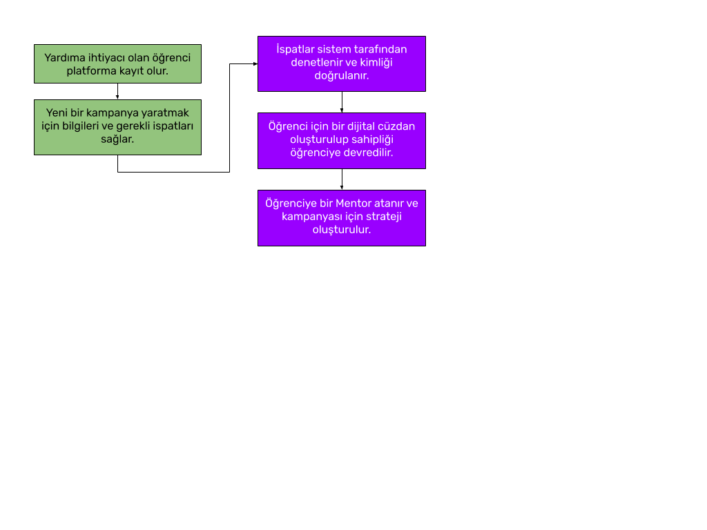

# Uçurtma Projesi

_Bu doküman hala daha geliştirme aşamasındadır. Dokümanın içerisinde katılımcılara ve yazarlara notlar bırakılmıştır. İlk versiyonuyla birlikte PDF formatında dağıtılacaktır._

## Amaç

Başarılı, çalışkan ya da yetenekli öğrencilerin eğitim hayatları sırasında hayal ettikleri hedefe ulaşmalarına yardımcı olacak maddi desteği güvenli, denetlenebilir ve adil bir şekilde sağlamak.

## Giriş ve Sürecin Tamamına Genel Bir Bakış

Platform, eğitimlerini tamamlamak ya da bir üst düzeye çıkartmak isteyen ancak bunun için yeterli maddi durumu olmayan öğrencileri yardımseverlerle buluşturmayı hedeflemektedir.

Akış Şekil 1’de tarif edildiği gibi öğrencinin platforma kayıt olmasıyla başlar ve platform geri kalan sürecin ilerlemesi için gerekli işlemleri otomatik olarak gerçekleştirir ve ilgili kişilerin bilgilendirmesini yapar.

Kayıt ve Doğrulama Akışı tamamlandıktan sonra Mentor’dan aldığı destek ile birlikte öğrenci kampanyasının hazırlığını bitirir ve paylaşır.

Kampanya boyunca yardımseverler kampanyanın detaylarına göre yardımda bulunurlar. Bu süre boyunca yardımseverlerin kampanyaya yaptıkları bağışlar Akıllı Kontrat ile güvence altına alınır. Böylece eğer kampanya hedefine ulaşamazsa yardımseverler yatırımlarını geri çekebilirler.

Kampanyanın tamamlanmasıyla birlikte kampanya koşullarında anlattığı süre boyunca düzenli olarak (ya da kampanyaya göre bir kereye mahsus olarak) ödemeleri alabilmesi sağlanmış olur. Bu sürecin kontrolü tamamen Akıllı Kontrat tarafından yapıldığı için güvene ihtiyaç duymamaktadır.

Eğer kampanyanın bir kilometre taşı varsa bu durumda öğrencinin bu adımı doğrulamak için gerekli ispatları sunması gerekir. Bunu bir örnek ile açıklayalım.

**Örnek:**
_“Adıyaman’da yaşayan bir öğrenci olarak Boğaziçi Üniversitesi Bilgisayar Mühendisliği bölümünü kazandım ancak durumum yeterli olmadığı için İstanbul’a okumak için gidemiyorum. Orada okuduğum süre boyunca her dönem GPA ortalamamın en az 3.0 olması koşulu ile aylık 1000 TL ihtiyacım var. Bunu her dönem size ispat edeceğim.”_

Yukarıdaki örnek kampanyada öğrencinin her dönem sonunda, yani yılda 2 defa notlarını ispatlaması gerekmektedir. Her dönemin 6 ay olduğu kabul edilirse bu öğrenci 6 ay boyunca her ayın ilk günü hesabından 1000 TL para çekebilecek ve 6 ay sonunda transkriptini paylaşarak ve bunu sponsorlarına ispat ederek gelecek 6 ay için de aylık 1000 TL gelirini garanti edebilecektir. Eğer 6 aylık dönem sonunda notu 2.80’e düşmüşse bu durumda sponsorları kendi aralarında bir oylama yapacaktır. Oylamanın sonucu aylık burs ücretini düşürmek ya da bursu tamamen iptal etmek olabilir.

## Yöntem

Platform, blok zinciri üzerinde açık kaynak kodlu olarak geliştirilecektir. Bu dokümanın tamamlanmasından sonra yeni platform özelliklerinin eklenmesi github üzerinde yaratılacak bir repository üzerinden takip edilecektir.
Her yaratılan yeni bir özellik ya da protokol önerisi çekirdek ekip tarafından yorumlacak ve herkese açık bir şekilde tartışılacaktır.

## Temel Özellikler

### 0.1 Destek Türleri

Hayallerini gerçekleştirmek isteyen öğrenciler kampanya çalışmalarını yaptıktan sonra destek toplayacaktır. Bu destek ilk kapsamda sadece bilira cinsinden yapılabilecektir. Diğer tarzdaki destekleri çok fazla manuel işlem ve kontrol getireceği için ilk kapsamda bunlara yer vermek riskli ve zor olacaktır.

İleriki aşamalarda bu destek maddi bir destek olabileceği gibi konusunda yetkin kişiler tarafından belirli bir alanda verilecek hizmet, profesyonel destek de olabilir. (Avukatlık, kalacak yer, vs.) Ancak bu tarz desteklerin sağlanabilmesi için Uçurtma içerisinde uygun organizasyonun oluşturulması ve çalışılması gerekir.

### 1.1 Açılış Sayfası

Uygulama bir web arayüzü ile erişilebilecektir. Bu sayfada sürecin nasıl işlendiği/ilerleyeceği gösterilmeli ve kullanıcıların keşfetmesi için kampanyalar gösterilmelidir. Öğrencilerin kimlik bilgileri anonim haline getirilerek kişisel gizlilikleri korunacaktır, isim ve soyisimleri yerine kullanıcı adları görüntülenecektir.

### 1.2 Üyelik Sistemi ve Sayfalar // Kayıt Sayfası

#### 1.2.1 Kayıt Sayfası

Daha sonra kampanya oluşturmak isteyen ya da bir kampanyaya sponsor olmak isteyen kişilerin öncelikli olarak girmesi gereken sayfadır. Bu aşamada kullanıcılardan istenecek bilgiler şunlardır:

1. İsim ve soyisim
2. Email adresi
3. Parolası
4. Doğum Tarihi
5. Kullanıcı Sözleşmesinin onaylanması

#### 1.2.2 Profil Düzenleme Sayfası

Üye olan kullanıcının daha detaylı bilgilerini paylaşabileceği, hesabını onaylayabileceği, fotoğraf ekleyebileceği sayfadır. Hesabını onaylamak isteyen kişilerden aşağıdaki bilgilerin istendiği bir forma yönlendirilecektir:

- Kimlik Numarası
- Okulu, bölümü
- Transkripti
- Ev adresi
- Kayıt olurken kullandığı adres “@edu” ile değilse okul e-maili.
- Kimlik, ehliyet ya da kimliğini kanıtlayacak bir belgenin arkalı önlü fotoğrafı
- Banka hesabını onaylayacak bir bilgi

Kullanıcıdan cryptocurrency cüzdanı oluşturulmalıdır - bu cüzdan aşaması geliştirilecek ve iş ortaklarımızla entegre edilecektir.

Bu tarz bilgilerin alınması sonrasında otomatik kimlik doğrulama yöntemleri çalışacak, sonucun olumsuz olması durumunda manuel kontroller gerçekleştirilecektir. Manuel kontrollerin en aza indirilmesi için platformun yapay zeka, resim işleme gibi yeteneklere sahip olması ya da uygun partnerlerle iletişime geçilmesi gerekeceği için MVP kapsamında bu özelliklerin kısıtlanmasını istiyoruz.
İlk etapta stratejik olarak bu fikre açık olabilecek okullara ulaşıp bir doğrulama yöntemi hazırlanacak ve sadece bu okullardaki öğrenciler kabul edilecektir. Bunun dijitalleştirilmesi için çalışmalar ve araştırmalar devam ediyor.

#### 1.2.3 Profil Sayfası

Kullanıcının profil sayfası, herkes tarafından görülebilecektir. Kullanıcı, profilinde hangi bilgilerinin herkese açık şekilde gösterilip gösterilemeyeceğini düzenleyebileceği bir sisteme sahip olmalıdır.

### 1.3 Öğrenci Kampanya Sayfaları

#### 1.3.1 Kampanya Yaratma Sihirbazı

Bu alanda kayıt yapan ve hesabını onaylayan öğrenciler, hedeflerini anlatan açıklamalar ve görsel içerikleri yükleyebilecek ve kendi hedeflerine göre kampanyalar yaratacaktır.
Öncelikli olarak bu sihirbazda şu bilgiler istenecektir:

- Kampanyanın ismi ve kategorisi
- Kampanya amacının kısa bir özeti
- Kampanyanın süresi ve hedefleri
- Kullanıcı, öncelikle kampanyanın süresini belirlemelidir.
- Belirlediği süreye göre en az (kampanya süresi / 2) kadar kilometre taşı belirlemelidir. Bu kilometre taşlarında neyi hedeflediğini açıkça yazmalıdır.
- Kampanya süresi boyunca öğrencinin küçük ödemelere ihtiyacı olabilir. Bu durumda, kilometre taşlarında bahsetmiş olduğu hedeflerin ne kadar gerçekleştiği de baz alınacaktır.
- Bu kısım tüm platformun en önemli özelliğidir. Öğrenciler hedeflerini, bütçelerini anlattıktan sonra bu ödemeleri hangi şartlar altında alacaklarını anlatmalıdırlar. Örneğin bir başarı sağlanması koşul olarak sunulduysa bu başarıyı nasıl ispat edeceklerini de anlatmaları gereklidir. Bu bir diploma, sertifika, ya da karne olabilir.
- Facebook, twitter ve diğer sosyal mecralarla bağlama şansı

Bu bilgiler sağlandıktan sonra kullanıcı, kampanya sayfasına yönlendirilecektir.

#### 1.3.2 Kampanya Sayfası

Kampanya sayfası, kampanyayı düzenleyen kullanıcının metin editörü ile düzenlemeler yapabildiği bir sayfadır. Bu sayfada, kullanıcının kampanya yaratma sihirbazında girdiği bilgiler gösterilmeli; onlara ek olarak kullanıcının kendi içeriğini oluşturabileceği bir alan bulunmalıdır. Bu editör içerisinde kullanıcı, fotoğraf, gif gibi görsel materyaller de ekleyebilmeli ve kendisine sponsor olacak kullanıcıları ikna etmelidir.

#### 1.3.3 Bağış Sayfası

Öğrencilere destek vermek isteyen kişilerin kayıt olarak ya da anonim bir şekilde istedikleri kampanyaya destek vermek için bu alanı kullanacaklar. Bu alan, öğrencilerin kampanya sayfalarında gömülü olan bir buton sayesinde gerçekleşecektir.
Bağış, kampanya sayfasında açılacak bir popup ya da gömülü ve butona tıkladığında görünür olan bir form aracılığı ile gerçekleşecektir.

### 1.4 Öğrencilerin ispat sağlaması

Aldıkları burslar belirli periyotlar halinde dağıtılır. Öğrenci her ay ya da belirledikleri kilometre taşlarında kanıtlar sunmalıdır. Bunlar küçük ama ispat gösteren görevler olabilir.
Eğer öğrenci bu görevleri başarır ve burs sağlayıcılar bu görevlerin doğru yapıldığının kanıtlandığını görürse onay verilir.

Örnek görevler:

- Sınıfta ders sırasında 15 saniyelik video kaydı al ve sisteme yükle.
- Dönem sonu transkriptini sisteme yükle.

Öğrencinin bir sonraki aşama için hakkı olan bağışı alabilmesi için görevlerinin hepsini başarıyla tamamlaması gerekebilir.
Teknoloji
https://www.ashoka.org/tr - bu tarz girişimlere destek veriyor.

#### Kaynaklar:

- [https://medium.com/@nuls/merging-blockchain-technology-with-public-welfare-a-first-attempt-of-social-significance-c8650b5334bd
](https://medium.com/@nuls/merging-blockchain-technology-with-public-welfare-a-first-attempt-of-social-significance-c8650b5334bd)
- [https://medium.com/coinmonks/decentralised-autonomous-co-operatives-dac-and-the-rise-of-the-new-commons-721f5e1a7d3](https://medium.com/coinmonks/decentralised-autonomous-co-operatives-dac-and-the-rise-of-the-new-commons-721f5e1a7d3)
- [https://give.si/](https://give.si/)

#### Cevaplanması Gereken Önemli Sorular

Bursun geri dönüşü olacak mı, öğrencinin geri ödeme zorunluluğu olacak mı, burs hangi koşullarda kesilecek, ödeme nasıl yapılacak?
Burs verenin ve bursiyerin kimliği açık mı olacak, birbirlerini tanıtacaklar mı?
Bir vakıf kurulacak mı?
Türkiyede bir merkezi olacak mı?
Para toplama ve dağıtma iznine nasıl sahip olacak?
Yurt dışından para kabul edilebiliyor mu?
Burs üst limiti ne olacak. ya milyonlar akarsa ?

#### Eklenmesi gerekenler

Mentorluk sistemi
